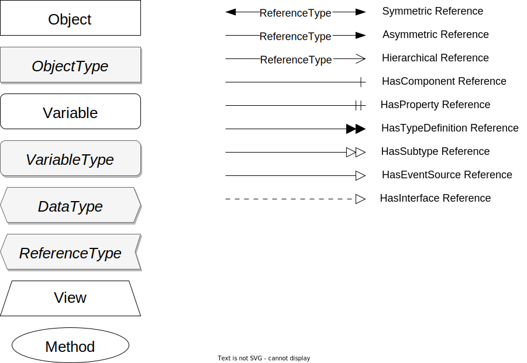

# OPC UA drawio library

This repository contains a library for the [drawio] diagram tool to create [OPC UA](https://opcfoundation.org/about/opc-technologies/opc-ua/) diagrams that follow the graphical notation described in [Annex C](https://reference.opcfoundation.org/Core/Part3/v105/docs/C) of Part 3 of the OPC UA specification.

This library includes all the different node types as well as reference types.
Simply download and import the XML file into the drawio editor by opening the Scratchpad editor using the little pencil button in the Scratchpad sidebar and then selecting import.
Or follow the tutorial in the [drawio blog](https://www.drawio.com/blog/public-custom-libraries).

The [showcase.drawio.svg] displays all the different node and reference types that are available with this library:

[drawio]: https://drawio.com
[showcase.drawio.svg]: showcase.drawio.svg
